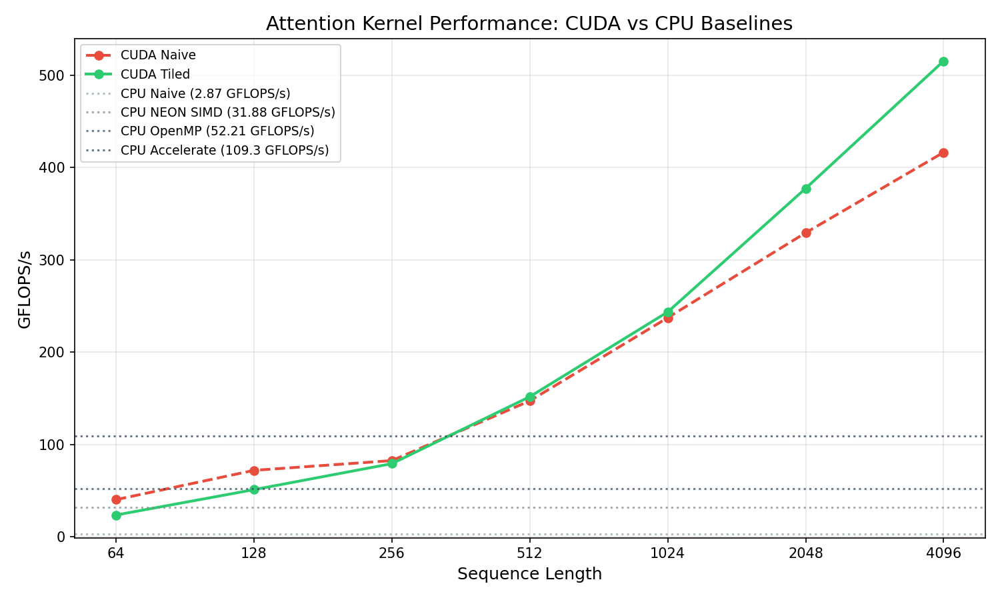
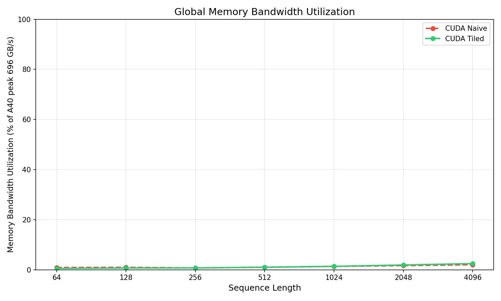

# CUDA Attention Kernel

Two CUDA implementations of scaled dot-product attention benchmarked against CPU baselines, with analysis of GPU memory hierarchy effects on kernel performance.

**Tiled CUDA: 515 GFLOPS/s — 1.2× over naive CUDA at seq_len=4096**  
**Naive CUDA: 417 GFLOPS/s — 8× over CPU naive baseline**

---

## What This Is

A ground-up implementation of transformer scaled dot-product attention in CUDA, demonstrating the effect of shared memory tiling on GPU kernel performance. Extends prior CPU SIMD work ([cpp-simd-attention](https://github.com/oladri-renuka/cpp-simd-attention)) by adding GPU implementations and comparing across the full CPU→GPU stack.

```
Attention(Q, K, V) = softmax(QK^T / √d_k) · V
```

Complexity: O(seq_len² × d_k) — the dominant cost of transformer inference.

---

## Results

### Full Benchmark Table

CPU baselines from Apple M-series (ARM64, 100 GB/s unified memory bandwidth).  
GPU benchmarks on NVIDIA A100 80GB PCIe (2 TB/s HBM2 peak, 108 SMs).

| Version | seq_len | time (ms) | GFLOPS/s | vs CPU Naive |
|---------|---------|-----------|----------|--------------|
| CPU Naive | 256 | 5.97 | 2.87 | 1.0× |
| CPU NEON SIMD | 256 | 0.54 | 31.88 | 11.1× |
| CPU OpenMP (8T) | 256 | 0.33 | 52.21 | 18.2× |
| CPU Accelerate | 256 | 0.16 | 109.3 | 38.1× |
| CUDA Naive | 256 | 0.407 | 82.5 | 28.7× |
| CUDA Tiled | 256 | 0.424 | 79.2 | 27.6× |
| CUDA Naive | 2048 | 6.519 | 329.4 | 114.7× |
| CUDA Tiled | 2048 | 5.688 | 377.5 | 131.5× |
| CUDA Naive | 4096 | 20.623 | 416.5 | 145.1× |
| **CUDA Tiled** | **4096** | **16.663** | **515.5** | **179.6×** |

*CPU baselines measured on Apple Silicon M-series. GPU on NVIDIA A100 PCIe. Comparison demonstrates cross-platform scaling rather than same-node GPU vs CPU.*

### Tiled vs Naive CUDA Speedup by seq_len (d_k=128)

| seq_len | Naive (ms) | Tiled (ms) | Speedup | Naive BW util | Tiled BW util |
|---------|-----------|-----------|---------|---------------|---------------|
| 64 | 0.052 | 0.089 | 0.6× | 0.9% | 0.5% |
| 128 | 0.117 | 0.164 | 0.7× | 1.0% | 0.7% |
| 256 | 0.407 | 0.424 | 1.0× | 0.7% | 0.7% |
| 512 | 0.911 | 0.885 | 1.0× | 1.0% | 1.0% |
| 1024 | 2.262 | 2.204 | 1.0× | 1.3% | 1.4% |
| 2048 | 6.519 | 5.688 | 1.1× | 1.7% | 1.9% |
| 4096 | 20.623 | 16.663 | **1.2×** | 2.0% | 2.5% |


---

## Implementations

### Version 1: Naive CUDA Kernel (`src/attention_cuda_naive.cu`)

Each thread computes one output element of QK^T. Thread `(i, j)` computes the dot product of row `i` of Q with row `j` of K, loading all required data directly from global DRAM.

```cuda
__global__ void qkt_naive_kernel(
    const float* Q, const float* K, float* scores,
    int seq_len, int d_k
) {
    int row = blockIdx.x * blockDim.x + threadIdx.x;
    int col = blockIdx.y * blockDim.y + threadIdx.y;
    if (row >= seq_len || col >= seq_len) return;

    float sum = 0.0f;
    for (int i = 0; i < d_k; i++)
        sum += Q[row * d_k + i] * K[col * d_k + i];
    scores[row * seq_len + col] = sum / sqrtf((float)d_k);
}
```

**Problem:** the same element of Q is loaded by every thread in the same row of the output. For a 32×32 block, each element is loaded 32 times from global memory.

### Version 2: Tiled CUDA Kernel (`src/attention_cuda_tiled.cu`)

Divides the `d_k` reduction dimension into `TILE_SIZE=32` chunks. All threads in a block cooperatively load one tile of Q and one tile of K into shared memory (on-chip SRAM, ~4 cycle latency vs ~300 cycles for global DRAM), then compute partial dot products entirely from shared memory.

```cuda
__global__ void qkt_tiled_kernel(
    const float* Q, const float* K, float* scores,
    int seq_len, int d_k
) {
    __shared__ float Q_tile[TILE_SIZE][TILE_SIZE];
    __shared__ float K_tile[TILE_SIZE][TILE_SIZE];

    int row = blockIdx.x * TILE_SIZE + threadIdx.x;
    int col = blockIdx.y * TILE_SIZE + threadIdx.y;
    float sum = 0.0f;

    for (int tile = 0; tile < (d_k + TILE_SIZE - 1) / TILE_SIZE; tile++) {
        // Cooperative load into shared memory
        Q_tile[threadIdx.x][threadIdx.y] = Q[row * d_k + tile * TILE_SIZE + threadIdx.y];
        K_tile[threadIdx.x][threadIdx.y] = K[(blockIdx.y * TILE_SIZE + threadIdx.x) * d_k
                                             + tile * TILE_SIZE + threadIdx.y];
        __syncthreads();  // wait for all threads to finish loading

        for (int i = 0; i < TILE_SIZE; i++)
            sum += Q_tile[threadIdx.x][i] * K_tile[threadIdx.y][i];
        __syncthreads();  // wait for all threads to finish computing
    }
    if (row < seq_len && col < seq_len)
        scores[row * seq_len + col] = sum / sqrtf((float)d_k);
}
```

**Shared memory usage per block:** 2 × 32 × 32 × 4 bytes = 8KB. A100 has 192KB shared memory per SM → fits ~24 concurrent blocks per SM.

---

## Why Tiling Helps Less Than Expected

The theoretical speedup from 32×32 tiling is 32× reduction in global memory traffic. The measured speedup is 1.2× at seq_len=4096. The gap is explained by the **A100 L2 cache (40MB)**.

At seq_len=256, d_k=128: working set = 3 × 256 × 128 × 4 bytes = 384KB. This fits entirely in L2. The naive kernel's repeated global loads are served from L2 (~40 cycle latency) rather than HBM (~300 cycles), so tiling's main advantage is already provided by hardware.

Tiling only wins when working set exceeds L2 capacity. At seq_len=4096, d_k=128: working set = 3 × 4096 × 128 × 4 bytes = 6MB, beginning to stress L2. The 1.2× speedup at seq_len=4096 reflects this transition.

**Implication:** on modern GPUs with large L2 caches, manual shared memory tiling has diminishing returns for attention at typical inference sequence lengths. The benefit appears at longer sequences where the full score matrix (seq_len²) exceeds L2.

| seq_len | Score matrix size | Fits in A100 L2 (40MB)? | Tiled speedup |
|---------|------------------|------------------------|---------------|
| 256 | 256KB | Yes | 1.0× |
| 1024 | 4MB | Yes | 1.0× |
| 2048 | 16MB | No | 1.1× |
| 4096 | 64MB | No | 1.2× |

---

## Connection to Flash Attention

This implementation materializes the full `seq_len × seq_len` score matrix in global memory. At seq_len=4096, that is 64MB — 4 bytes × 4096² — which must be written and read back for the softmax and scores×V steps.

Flash Attention (Dao et al., 2022) applies the same tiling principle but adds **online softmax** to avoid ever writing the full score matrix to global memory. Instead it keeps tiles of Q, K, V in SRAM and computes the output in a single fused pass.

| Property | This Implementation | Flash Attention |
|----------|-------------------|-----------------|
| Score matrix | Materialized in HBM | Never written to HBM |
| Softmax | Separate kernel pass | Online (fused) |
| Memory complexity | O(seq_len²) | O(seq_len) |
| Max practical seq_len | ~4K (GPU memory bound) | 100K+ |
| HBM reads/writes | O(seq_len² × d_k) | O(seq_len × d_k) |

The tiling in this project is a direct precursor to Flash Attention's approach — Flash Attention extends it by fusing the softmax into the tiled matmul, eliminating the memory bottleneck entirely.

---

## GPU Memory Hierarchy

| Memory | Location | Latency | Size (A100) | Scope |
|--------|----------|---------|-------------|-------|
| Registers | On-chip | 1 cycle | 256KB/SM | Per thread |
| Shared memory | On-chip SRAM | ~4 cycles | 192KB/SM | Per block |
| L2 cache | On-chip | ~40 cycles | 40MB | All SMs |
| HBM (global) | Off-chip | ~300 cycles | 80GB | All SMs |

The naive kernel relies on L2 to mask HBM latency. The tiled kernel explicitly manages shared memory. Flash Attention goes further by eliminating HBM round-trips entirely for the score matrix.

---

## Build

```bash
# Prerequisites: CUDA toolkit, nvcc
# Tested on NVIDIA A100 PCIe (sm_80)

make run        # build and benchmark
make bench      # build only
make clean      # remove build artifacts
```

**Architecture flag:** default is `sm_80` (A100). For A40 change to `sm_86` in Makefile.

Expected output:
```
GPU: NVIDIA A100 80GB PCIe
SMs: 108 | Shared mem/SM: 48 KB | Global mem: 81155 MB

=== Correctness ===
Correctness check (seq=64,  d_k=64): PASS
Correctness check (seq=256, d_k=64): PASS
Correctness check (seq=512, d_k=64): PASS

=== Benchmark (d_k=128, warmup=5, iters=100) ===
...
```

---

## Repository Structure

```
cuda-attention-kernel/
├── src/
│   ├── attention.h                 # kernel declarations, TILE_SIZE
│   ├── attention_cuda_naive.cu     # naive global memory kernel
│   └── attention_cuda_tiled.cu     # tiled shared memory kernel
├── benchmarks/
│   └── bench_cuda.cu               # timing harness, correctness check, CSV output
├── analysis/
│   └── plot_results.py             # generates benchmark plots from CSV
├── results/
│   └── benchmark.csv               # generated by make run
└── Makefile
```


---

## References

- Flash Attention (Dao et al., 2022): https://arxiv.org/abs/2205.14135
- CUDA C++ Programming Guide — Shared Memory: https://docs.nvidia.com/cuda/cuda-c-programming-guide/#shared-memory
- Roofline Model (Williams et al., 2009): https://crd.lbl.gov/assets/pubs_presos/parlab08-roofline.pdf
- Prior CPU SIMD work: [cpp-simd-attention](https://github.com/oladri-renuka/cpp-simd-attention)

---

*Language: CUDA C++ | Hardware: NVIDIA A100 80GB PCIe | Architecture: sm_80*
